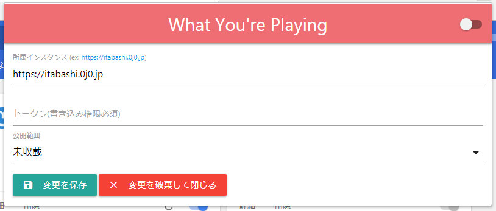

# What You're Playing(Google Chrome Extension)
An extension of Google Chrome for Mastodon that toots what you're listening to

## Overview | 概要
This extension toots what you're listening to now!

## Features | 特徴
This is a list of features.
* Deliver information of videos on YouTube
* Deliver information of videos on Niconico(ニコニコ動画)
* Deliver information of channels on TwitCasting(ツイキャス)

## How to Use | どうするのー？
Please edit configurate from option page.
We recommend to generate new app for this extension to provide a token.

## Others | その他
These codes are based on an application, which was only for me, so it might not work well.

## Author | つくったひとー！！
* [@ProgrammerGenboo](https://itabashi.0j0.jp/@ProgrammerGenboo)
* [@ProgrammerGenboo](https://knzk.me/@ProgrammerGenboo)

## LICENSE | ライセンス
[MIT LICENSE](/LICENSE)