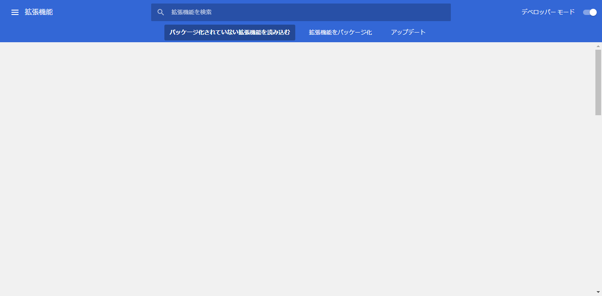
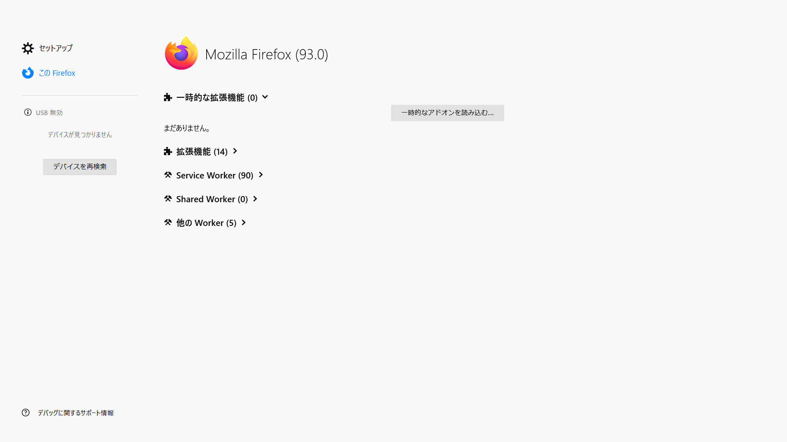
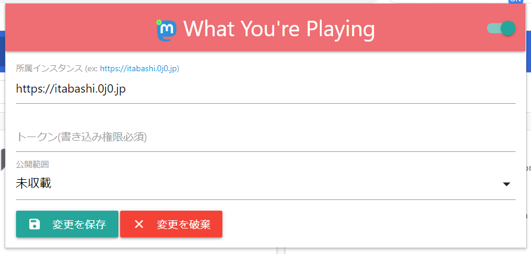
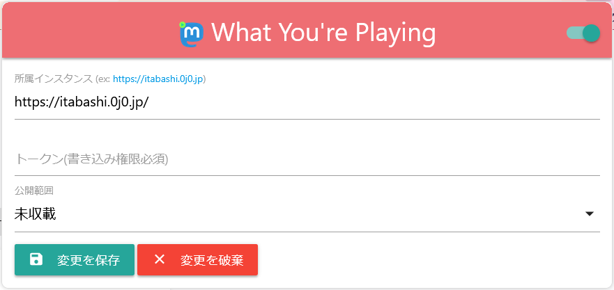

#  What You're Playing

Mastodonをはじめとしたサービスになうぷれ投稿するChrome/Firefox拡張機能

## 他の言語 | Languages
* [英語 | English](/README.md)

## 概要 | Overview
現在再生中のものに関する情報を、Mastodonなどの各種SNSに投稿します。

## 対応サービス | Available Services
* 取得元
  * YouTube(動画)
  * ニコニコ動画(動画, 生配信)
  * ツイキャス(チャンネル)
  * nana(音源)
  * KnzkLive(ライブ)
* 配信先
  * 任意のMastodonインスタンス
  * 任意のMisskeyインスタンス

## インストール方法 | Installation
* Google Chrome
  1. このレポジトリからWhat You're Playingをダウンロードし、解凍します。

  2. `chrome://extensions`にある`デベロッパーモード`を有効にします。

  3. `パッケージされていない拡張機能を読み込む`より、解凍されたフォルダを参照しインストールします。
     

* Mozilla Firefox
  1. このレポジトリからWhat You're Playingをダウンロードし、解凍します。

  2. `about:debugging#/runtime/this-firefox`に移動します。 
     

  3. `一時的なアドオンを読み込む…`より、ダウンロードしたzipや解凍されたフォルダ内のファイルを参照し、インストールします。

  4. ブラウザを再起動するとアドオンが削除されます。 
	お手数おかけいたしますが、その都度改めてインストールし設定してください。

## ご利用の前に | How to Use
はじめに、設定画面からトークンの設定を行ってください。 
トークンはWhat You're Playing用に新しくアプリを生成して取得するか、もしくはデベロッパーツールからの取得を推奨しています。

## つくったひと | Contact
* Fediverse
  * [いたばしのげんちゃん。(ProgrammerGenboo@itabashi.0j0.jp)](https://itabashi.0j0.jp/@ProgrammerGenboo)
* Twitter
  * [どっかのげんちゃん。(@GenInAnywhere)](https://twitter.com/GenInAnywhere)
  * [どっかの麺つゆ。＋(@SomeoneMentsuyu)](https://twitter.com/SomeoneMentsuyu)

## ライセンス | License
[MIT LICENSE](/LICENSE)